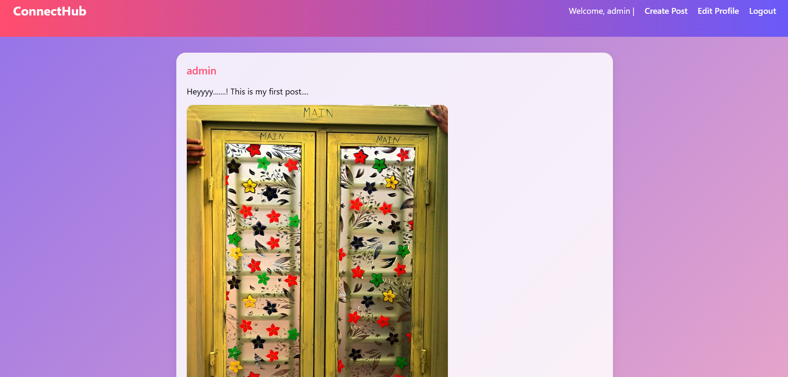
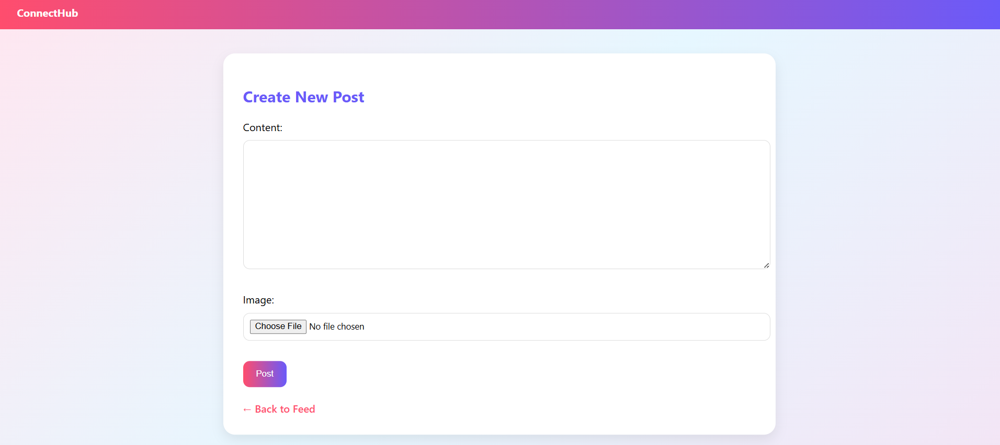
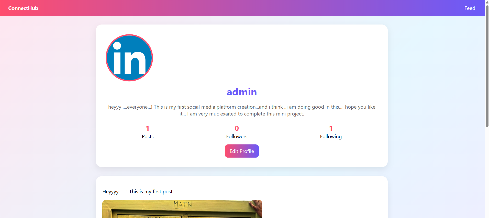
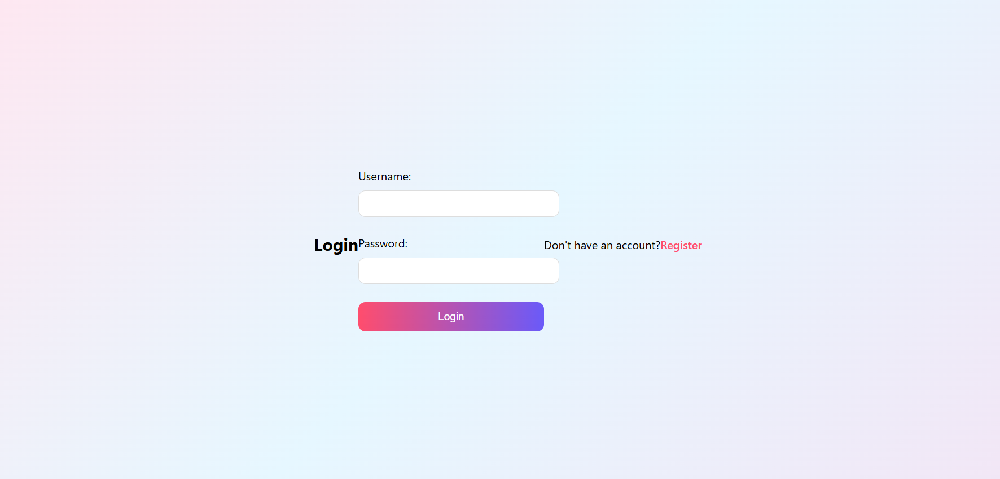
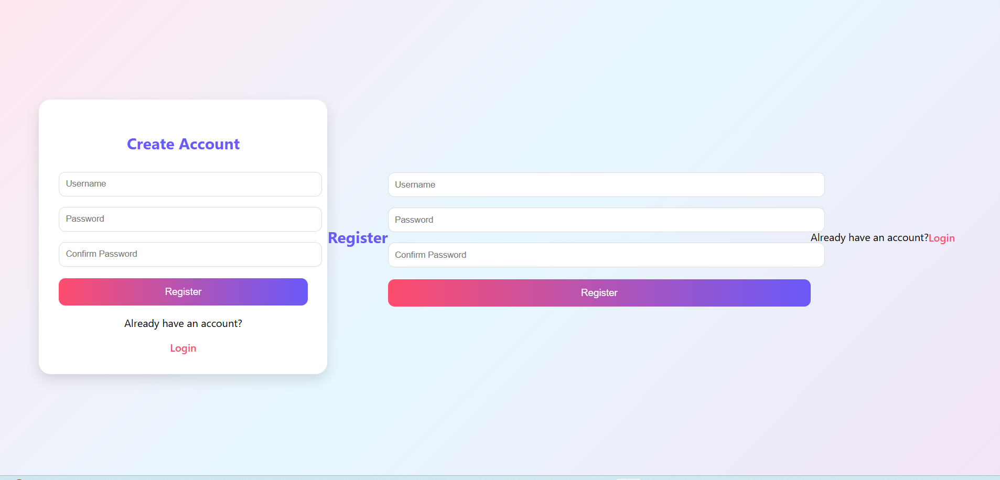

Here’s a **clean, professional README.md for Task 2 submission** (your ConnectHub Django project). You can directly paste this into GitHub.

---

#  ConnectHub - Django Social Media Web Application

## Project Overview

ConnectHub is a simple social media web application built using **Django (Python)**. It allows users to create accounts, share posts with images, like and comment on posts, and follow other users. The project demonstrates full-stack web development using Django’s MVC architecture.

---

##  Features

### User Authentication

* User Registration
* Login / Logout system
* Secure password handling

###  Posts System

* Create text posts
* Upload images with posts
* View all posts in feed

###  Like System

* Like / Unlike posts
* Real-time like count

###  Comments System

* Add comments on posts
* View comments under each post

### Profile System

* User profile page
* Profile picture and bio
* View user posts
* Followers & Following system

### Follow System

* Follow / Unfollow users
* View followers count
* View following count

---

##  Tech Stack

* **Backend:** Django (Python)
* **Frontend:** HTML, CSS
* **Database:** SQLite3
* **Media Handling:** Django Media Files
* **Version Control:** Git & GitHub

---

##  Project Structure

```
ConnectHub/
│
├── connecthub/        # Project settings
├── socialapp/         # Main application
│   ├── models.py
│   ├── views.py
│   ├── forms.py
│   ├── urls.py
│
├── templates/         # HTML templates
│   ├── home.html
│   ├── login.html
│   ├── register.html
│   ├── profile.html
│   ├── create_post.html
│
├── media/             # Uploaded images
├── static/            # CSS/JS files
├── db.sqlite3
├── manage.py
```

---

##  Installation & Setup

### 1. Clone Repository

```bash
git clone https://github.com/your-username/connecthub.git
cd connecthub
```

### 2. Create Virtual Environment

```bash
python -m venv venv
venv\Scripts\activate   # Windows
```

### 3. Install Dependencies

```bash
pip install -r requirements.txt
```

### 4. Run Migrations

```bash
python manage.py makemigrations
python manage.py migrate
```

### 5. Create Superuser

```bash
python manage.py createsuperuser
```

### 6. Run Server

```bash
python manage.py runserver
```

---

Screenshots

Below are some key pages of the ConnectHub application:

 Home Feed

Displays all posts from users with like, comment, and image support.

<p align="center">  </p>
 Create Post

Users can create new posts with text and image upload.

<p align="center">  </p>
 User Profile

Shows user details, profile picture, followers, following, and posts.

<p align="center">  </p>
 Login Page

Secure authentication system for users.

<p align="center">  </p>
Register Page

New users can create an account.

<p align="center">  </p>

---

## Learning Outcomes

* Django project structure
* User authentication system
* CRUD operations
* Media file handling
* Database relationships (ForeignKey, ManyToMany)
* Git & GitHub workflow

---

## Author

**Name:** Afsa Shaik
**Project:** ConnectHub Django Social Media App
**Purpose:** Internship / Academic Submission

---

## Note

This project is built for learning purposes and demonstrates core Django functionality including authentication, media handling, and relational database design.

